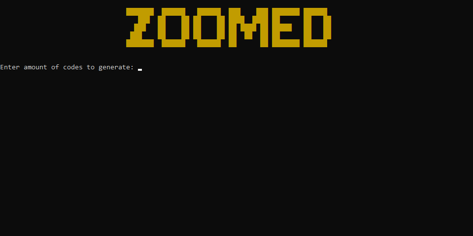
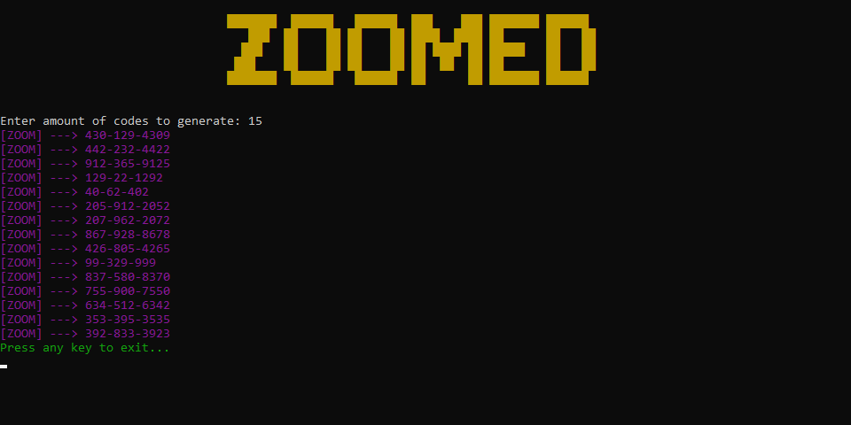

# ZOOMED 
**A simple golang script which generates random numbers based off the lenght of zoom meeting id's**

## Preview

**I have left a compiled version of it so you can simply download this repo and then run the .exe file and away you are**

# Compiling From Source
There are a few things to note when compiling this from the source, first install [golang]("google.com") after that you are going to need to run a command to get things working. `go get github.com/gookit/color` run this in your terminal to download the package needed. After this either run `go run zoom.go` to run it one time, or compile it for your operating system `go build`.
